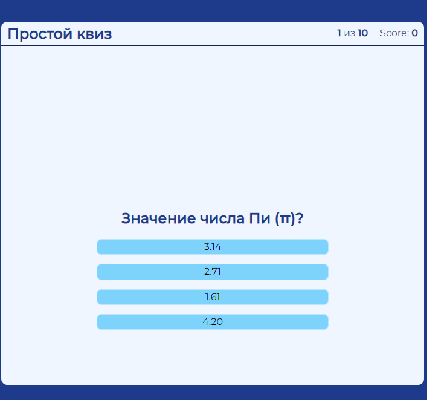
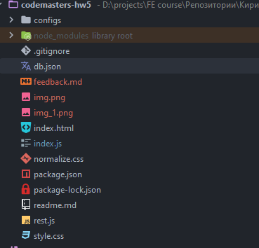

1. Немного надо с цветами поработать .
2. Я поймал такой кейс, что картинка еще не загрузилась, а контент уже доступен. Обычно на время пока всё не загрузится
   показывают всякие спиннеры, полосы загрузки и тп, чтобы юзер видел, что тут что-то есть и оно грузится.
   
3. Раскидай всё по директориям, выглядит не очень красиво
